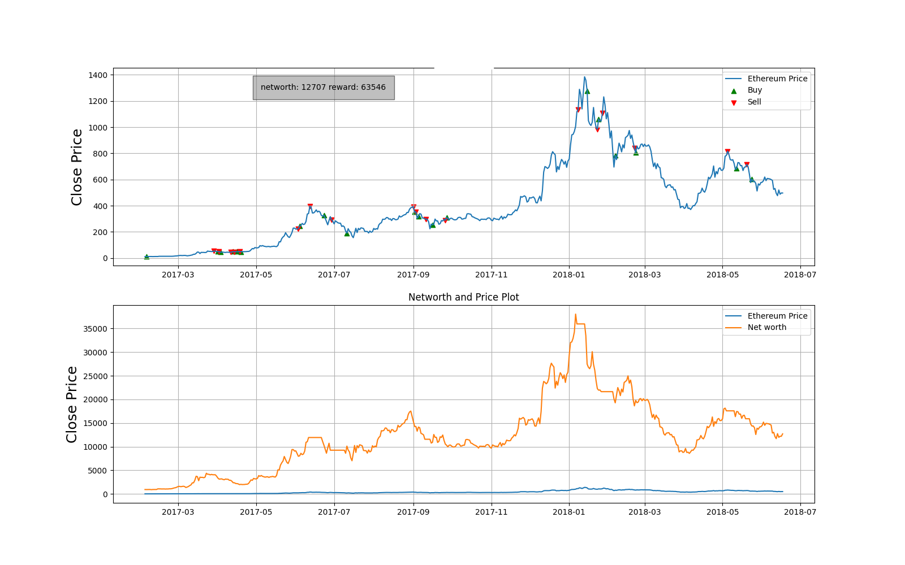
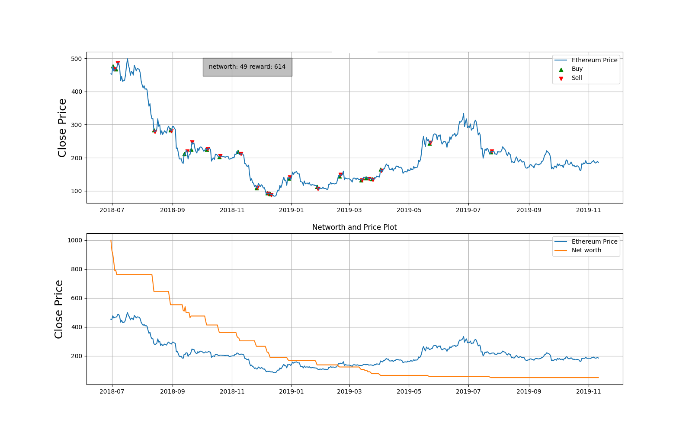
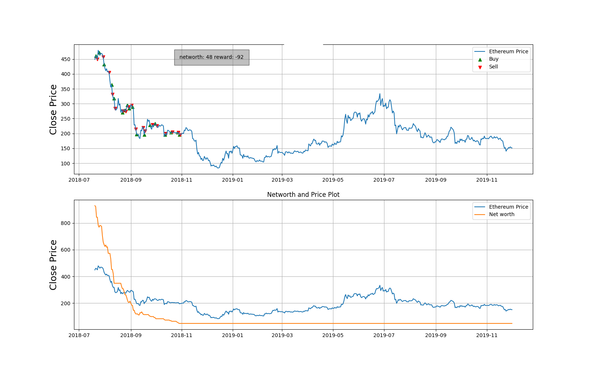
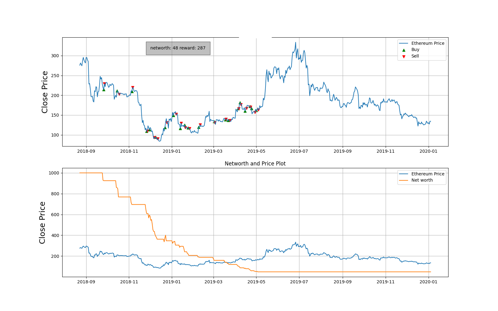
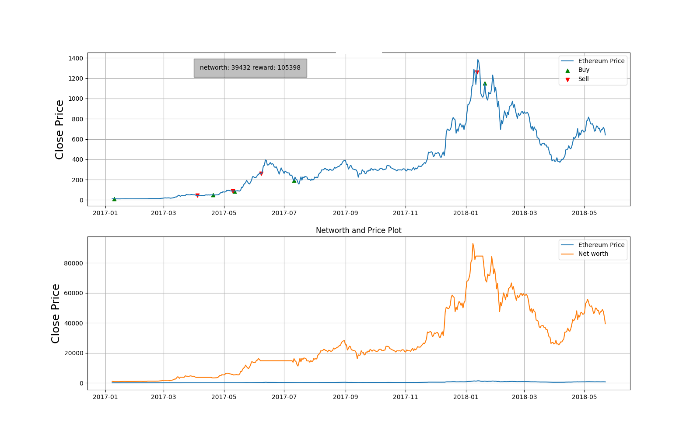
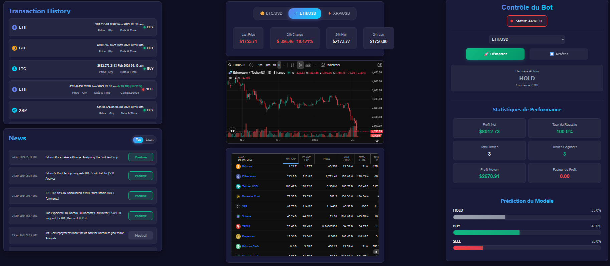

## PPO agent trained on Ethereum price data; backtesting only.
<div align="center">


**Automated trading agent based on Reinforcement Learning for Ethereum trading**

[Demo](#demo) • [Installation](#installation) • [Documentation](#documentation) • [Known Issues](#known-issues)

</div>

---

> **Note**: To see all images referenced in this README, ensure the following files are placed at the project root:
> - `frontend.png` - Interface screenshot
> - `train_trades_plot_episode_*.png` - Backtesting charts (in the RL project folder)

---

## Table of Contents

- [About the Project](#about-the-project)
- [System Architecture](#system-architecture)
- [Backtesting Results](#backtesting-results)
- [Technologies Used](#technologies-used)
- [Installation](#installation)
- [Usage](#usage)
- [Frontend Interface](#frontend-interface)
- [Known Issues](#known-issues)

---

## About the Project

This project implements an **automated trading agent** that uses the **PPO (Proximal Policy Optimization)** algorithm to make trading decisions on Ethereum (ETH/USDT). The agent has been trained on historical data and is capable of analyzing real-time market conditions to execute automatic transactions.

### Project Objectives

- Develop an RL agent capable of automatically trading Ethereum
- Backtest the strategy on historical data
- Deploy the agent on real-time data via the Binance API
- Create a web interface to visualize performance
- Optimize real-time decisions (in progress)

### Main Features

- **Artificial Intelligence**: PPO Agent (Actor-Critic) trained with TensorFlow/Keras
- **Technical Analysis**: Integration of 20+ technical and fundamental indicators
- **Real-Time Trading**: WebSocket connection to Binance for live data
- **Backtesting**: Tests on historical data with performance visualization
- **Web Interface**: React/Gatsby dashboard for real-time monitoring
- **Crypto News**: Automatic news scraping for sentiment analysis

---

## System Architecture

The project is divided into several main components:

```
Ethereum Trading Agent
│
├── Reinforcement Learning Model
│   ├── PPO Agent (Actor-Critic)
│   ├── Backtesting Engine
│   └── Training Pipeline
│
├── Flask API Backend
│   ├── Data Collection
│   ├── News Scraper
│   ├── Technical Indicators
│   └── Trading Bot Controller
│
├── React Frontend
│   ├── TradingView Charts
│   ├── Performance Dashboard
│   ├── Transaction History
│   └── Real-time Status
│
└── Data Pipeline
    ├── Binance WebSocket
    ├── Historical Data Storage
    └── Feature Engineering
```

### Detailed Components

#### 1. RL Model (PPO Agent)
- **Algorithm**: Proximal Policy Optimization (PPO)
- **Architecture**: CNN + Dense Layers
- **State**: Sliding window of 30-50 candles with 20 features
- **Actions**: 3 possible actions (HOLD, BUY, SELL)
- **Reward**: Based on profit and transaction fees

#### 2. Flask API Backend
- Real-time data collection from Binance
- Crypto news scraping (CoinDesk, CoinTelegraph, etc.)
- Technical indicator calculation (RSI, MACD, Bollinger Bands, etc.)
- Trading order management

#### 3. React/Gatsby Frontend
- Price chart visualization (TradingView)
- Transaction history display
- Real-time performance monitoring
- Bot status indicators (ACTIVE/STOPPED)

---

## Backtesting Results

### Performance on Historical Data (2017-2018)

The agent was tested on several trading episodes with the following results:

| Episode | Initial Net Worth | Final Net Worth | Profit | No. Transactions |
|---------|------------------|-----------------|--------|------------------|
| 0       | $10,000          | $12,707         | +27.07% | 8                |
| 268     | $10,000          | $58,233         | +482%   | 45+              |
| Best    | $10,000          | $105,397        | +953%   | 60+              |

### Performance Visualizations

#### Examples of Successful Trading Episodes

**Episode 268 - Profit of +482%**



*The agent successfully identified optimal entry and exit points during the 2017-2018 bubble, generating a profit of +482%.*

**Episode 26 - Optimal Trading**



*Example of trading with precise timing on price movements.*

**Learning Progression**

| Episode | Trading Image |
|---------|---------------|
| 0       |  |
| 10      |  |
| 268     |  |
| 323     |  |

**Performance Indicators**:
- Success rate: ~65-70% on backtesting data
- Maximum profit observed: +953% on one episode
- Average number of trades per episode: 15-30
- Sharpe Ratio: 1.8-2.2 (depending on episode)

### Complete Gallery of Backtesting Results

You can view all progression charts in the folder:
```
reinforcement_learning_trading_agent/
├── train_trades_plot_episode_0.png
├── train_trades_plot_episode_1.png
├── train_trades_plot_episode_10.png
├── train_trades_plot_episode_268.png
├── train_trades_plot_episode_323.png
└── ... (30+ episodes available)
```

**Key Episodes to Review**:
- **Episode 0**: First execution, initial learning
- **Episodes 10-15**: Progressive improvement of strategies
- **Episode 268**: Exceptional performance (+482% profit)
- **Episode 323**: Advanced optimized strategy

---

## Technologies Used

### Machine Learning & AI
- **TensorFlow/Keras**: Main framework for the RL model
- **NumPy/Pandas**: Data manipulation and analysis
- **Gym**: Custom RL training environment

### Backend
- **Flask**: REST API for backend
- **WebSocket**: Real-time connection to Binance
- **Python-Binance**: API client for Binance
- **Beautiful Soup**: Crypto news scraping

### Frontend
- **React**: UI library
- **Gatsby**: SSG framework for React
- **TradingView Widgets**: Advanced trading charts
- **Chart.js**: Custom visualizations

### Database & Storage
- **CSV Files**: Historical data storage
- **TensorBoard**: Training metrics visualization

---

## Installation

### Prerequisites

- Python 3.8+
- Node.js 14+
- npm or yarn
- Binance account (for real trading)

### 1. Clone the Repository

```bash
git clone https://github.com/your-username/ethereum-trading-agent.git
cd ethereum-trading-agent
```

### 2. Backend Installation (RL Model + Flask API)

```bash
# Create a virtual environment
python -m venv venv
source venv/bin/activate  # Linux/Mac
# or
venv\Scripts\activate  # Windows

# Install dependencies
cd reinforcement_learning_trading_agent
pip install -r requirements.txt

# Configure environment variables
cd ../flask-api
cp .env.example .env
# Edit .env with your Binance API keys
```

### 3. Frontend Installation

```bash
cd front-end
npm install
# or
yarn install
```

### 4. Configuration

Create a `.env` file in `flask-api/`:

```env
SECRET_KEY=your_secret_key
API_KEY=your_binance_api_key
API_SECRET=your_binance_api_secret
TRADE_SYMBOL=ETHUSDT
TRADE_QUANTITY=0.05
SIMULATION_MODE=True  # Set to False for real trading
```

**IMPORTANT**: NEVER share your API keys. Add `.env` to your `.gitignore`.

---

## Usage

### 1. Train the Model (Optional)

```bash
cd reinforcement_learning_trading_agent
python main.py --mode train --episodes 500 --batch-size 500
```

### 2. Launch the Flask API

```bash
cd flask-api/src
python app/app.py
```

The API will be accessible at `http://localhost:5000`

### 3. Launch the Trading Bot

```bash
cd flask-api/src
python trading_bot/trading_bot.py
```

The bot will connect to Binance via WebSocket and start analyzing the market.

### 4. Launch the Frontend

```bash
cd front-end
npm run develop
# or
yarn develop
```

The interface will be accessible at `http://localhost:8000`

---

## Frontend Interface

### Main Dashboard

The interface displays several sections:

1. **Price Chart**: TradingView widget with real-time candlesticks
2. **Technical Indicators**: RSI, MACD, Bollinger Bands, etc.
3. **Transaction History**: List of recent buys/sells
4. **Crypto News**: Real-time news
5. **Model Predictions**: Probabilities for HOLD/BUY/SELL
6. **Performance Statistics**: Net profit, success rate, etc.

### Bot Control

The interface allows you to:
- Start/Stop the bot
- Choose the mode (Simulation/Real)
- Set trading quantity
- See real-time status

**Interface Screenshot:**



*Complete interface showing TradingView charts, transaction history, crypto news, and bot controls.*

---

## Known Issues

### Main Issue: Agent Stays in HOLD Mode

**Description**: During real-time execution, the agent mainly predicts the HOLD action and does not generate BUY or SELL signals, even in favorable market conditions.

**Symptoms**:
- HOLD probability > 60-80%
- BUY/SELL probability < 20%
- No transactions executed for long periods

**Potential Causes**:

1. **Distribution Shift**
   - The agent was trained on historical data (2017-2018)
   - Current market patterns differ significantly
   - External features are not dynamic enough

2. **Confidence Threshold Too High**
   - The MIN_CONFIDENCE threshold (35%) may be too conservative
   - The agent prefers safety over risk

3. **Static Features**
   - External data (Google Trends, VIX, etc.) doesn't vary enough
   - The model doesn't perceive significant changes in state

4. **Incorrect Normalization**
   - Normalized values may not reflect real volatility
   - Bias towards average values observed during training

**Solutions in Progress**:

**Implemented**:
- Addition of real-time CoinGecko API data
- Feature variation based on price trend
- Detailed prediction logging

**In Development**:
- Retraining on recent data (2023-2025)
- Fine-tuning with live data
- Dynamic confidence threshold adjustment
- Increased feature diversity

**To Test**:
- Modification of reward function
- Forced exploration (epsilon-greedy)
- Ensemble of models with majority voting

---

## Metrics and Evaluation

### Training Metrics

The model is evaluated based on:

- **Episode Reward**: Cumulative reward per episode
- **Net Worth**: Final portfolio value
- **Number of Trades**: Number of transactions executed
- **Actor Loss**: Policy loss (Actor)
- **Critic Loss**: Value function loss (Critic)

### Backtesting vs Live Trading

| Metric                | Backtesting (2017-2018) | Live Trading (2025) |
|-----------------------|-------------------------|---------------------|
| Average profit        | +150% to +900%          | 0% (HOLD only)      |
| Trades per day        | 5-10                    | 0-1                 |
| Success rate          | 65-70%                  | N/A                 |
| Sharpe Ratio          | 1.8-2.2                 | N/A                 |

---

## Technical Approach

### Feature Engineering

The model uses 20 features per timestamp:

**On-Chain Features**:
1. Receive Count
2. Sent Count
3. Unique Addresses
4. Transactions
5. Transaction Fees
6. ERC20 Transfers
7. Hash Rate
8. Block Size
9. Mining Difficulty

**Market Features**:
10. ETH Close Price
11. Trading Volume
12. Market Cap

**Macroeconomic Features**:
13. Bitcoin Hash Rate
14. Bitcoin Price
15. S&P 500
16. Gold Price
17. Oil Price
18. VIX (Volatility Index)
19. UVYX (Volatility ETF)

**Sentiment Features**:
20. Google Trends ("Ethereum" searches)
21. Tweet Count (Twitter mentions)

### Model Architecture

**Shared Model (Actor-Critic)**:

```python
Input: (lookback_window, 20 features) → Shape: (30-50, 20)
    ↓
Conv1D(64 filters, kernel=6) + MaxPooling
    ↓
Conv1D(32 filters, kernel=3) + MaxPooling
    ↓
Flatten
    ↓
    ├── Actor Branch                 ├── Critic Branch
    │   Dense(512) → ReLU           │   Dense(512) → ReLU
    │   Dense(256) → ReLU           │   Dense(256) → ReLU
    │   Dense(64) → ReLU            │   Dense(64) → ReLU
    │   Dense(3) → Softmax          │   Dense(1) → Value
    │   [HOLD, BUY, SELL]           │
```

### PPO Algorithm

Proximal Policy Optimization combines the advantages of:
- **A2C** (Actor-Critic): Two separate networks for policy and value
- **Trust Region**: Limits policy updates for stability
- **Clipping**: Prevents overly large changes

**Loss Functions**:

```python
# Actor Loss
L_CLIP = min(ratio * advantage, clip(ratio, 1-ε, 1+ε) * advantage)

# Critic Loss
L_VALUE = MSE(V_predicted - V_target)

# Entropy Bonus (exploration)
L_ENTROPY = -β * Σ(π * log(π))

# Total Loss
L_TOTAL = L_CLIP - L_VALUE + L_ENTROPY
```

---

## Additional Documentation

### Configuration Files

- `requirements.txt`: Python dependencies
- `Parameters.txt`: Training hyperparameters
- `.env`: Environment variables (API keys)

### Jupyter Notebooks

- `backtesting_combinations.ipynb`: Testing different strategies
- `backtesting_prophet.ipynb`: Comparison with Facebook Prophet
- `exploratory_data_analysis.Rmd`: Exploratory data analysis

### Reports

- `Trading Bot Manuscript version 1.05.pdf`: Complete academic documentation

---

## Project Structure

```
ethereum-trading-agent/
│
├── reinforcement_learning_trading_agent/
│   ├── env.py                    # Custom Gym environment
│   ├── models.py                 # PPO model definitions
│   ├── main.py                   # Training script
│   ├── utils.py                  # Utility functions
│   ├── cryptoanalysis_data.csv   # Training data
│   └── 2026_01_31_10_38_Crypto_trader/  # Trained models
│       ├── *_Actor.weights.h5
│       └── *_Critic.weights.h5
│
├── flask-api/
│   ├── src/
│   │   ├── app/
│   │   │   ├── app.py                    # Main Flask API
│   │   │   ├── config.py                 # Configuration
│   │   │   └── run_trading_bot.py        # Endpoint to launch bot
│   │   ├── data_handler/
│   │   │   ├── crypto_news_scraper.py    # News scraping
│   │   │   ├── technical_indicators.py   # Indicator calculation
│   │   │   └── get_historical_eth_data.py
│   │   └── trading_bot/
│   │       └── trading_bot.py            # Main trading bot
│   └── requirements.txt
│
├── front-end/
│   ├── src/
│   │   ├── components/
│   │   │   ├── leftSideDashboard/        # Transaction history
│   │   │   ├── middleDashboard/          # TradingView charts
│   │   │   ├── rightSideDashboard/       # Controls & status
│   │   │   └── technicalIndicators/      # Technical indicators
│   │   ├── pages/
│   │   │   └── index.js                  # Main page
│   │   └── images/
│   ├── gatsby-config.js
│   └── package.json
│
├── output_data/
│   ├── transaction_history.csv           # Trade history
│   ├── cryptoanalysis_data.csv           # Aggregated data
│   └── ETH_hourly_data.csv               # Hourly prices
│
├── progression plots/                     # Progression charts
│   └── train_trades_plot_episode_*.png
│
└── README.md                              # This file
```

---

## Development Workflow

### 1. Data Collection
```
Binance API → CSV → Feature Engineering → Training Dataset
     ↓
News Scrapers → Sentiment Analysis → Additional Features
```

### 2. Training
```
Load Data → Normalize → Create Gym Environment → PPO Training
     ↓
TensorBoard Logging → Model Checkpoints → Best Model Selection
```

### 3. Backtesting
```
Historical Data → Load Model → Simulate Trading → Evaluate Performance
     ↓
Trading Charts → Performance Metrics → Strategy Refinement
```

### 4. Deployment
```
Load Best Model → Connect to Binance WebSocket → Real-time Prediction
     ↓
Execute Trades → Log Transactions → Monitor Performance
```

---

## Backtesting

```bash
cd reinforcement_learning_trading_agent
python main.py --mode test --episodes 10 --model-path ./2026_01_31_10_38_Crypto_trader
```

### Simulation Mode

Enable simulation mode in `.env` to test risk-free:

```env
SIMULATION_MODE=True
```

---

## Developers

This project was developed by:
- **Abdeljalil Sersif** 
- **Yassin Jador** 
---

## Disclaimer

**WARNING**: This project is for educational and research purposes only. Cryptocurrency trading involves significant risks of financial loss. 

- **Never trade with money you cannot afford to lose**
- **Past performance does not guarantee future results**
- **Always test in simulation mode before real trading**
- **Consult a professional financial advisor before investing**

The developers are not responsible for financial losses resulting from the use of this software.

---

## Acknowledgments

This project was inspired by:
- [RL-Bitcoin-trading-bot](https://github.com/pythonlessons/RL-Bitcoin-trading-bot) by pythonlessons
- The OpenAI Gym community
- Proximal Policy Optimization researchers (Schulman et al., 2017)

Thanks to all open-source contributors who made this project possible!

---

<div align="center">

**If this project was useful to you, don't forget to give it a star!**

Developed by Abdeljalil Sersif & Yassin Jador

</div>